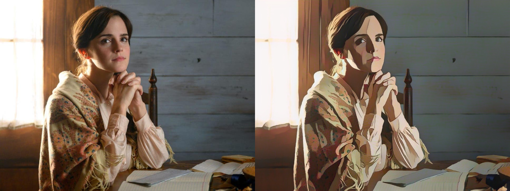

# Cartoonizer

> Convert images and videos into a cartoon!

The webapp is deployed here - https://cartoonize-lkqov62dia-de.a.run.app

## Prerequisites for Google Cloud and Algorithmia

**These are important steps if you want to leverage Google buckets, signed URLs and Algorithmia's platform.**

### Cloud Run authentication
To use any functionalities pertaining to Google Cloud, you'll need a global authentication file (JSON). You can obtain this JSON by following the steps given here - [Getting started with authentication](https://cloud.google.com/docs/authentication/getting-started)

After you get the JSON file, rename it to `token.json` (so that it's compatible with the codebase). 

Set the environment variable in your terminal -
```
export GOOGLE_APPLICATION_CREDENTIALS="/path/to/token.json"
```
**Notes**:
- You can set it permanently by adding this line to `~/.bashrc`.
- `Dockerfile` already includes the setting of this particular environment variable. :)


### Algorithmia
We used the Serveless AI Layer product of [Algorithmia](https://algorithmia.com/serverless-ai-layer) for inference on videos.
To learn more on how to deploy your model in Algorithmia, check here - https://algorithmia.com/developers

## Installation

### Application tested on:

- python 3.7
- tensorflow 2.1.0 
- tf_slim 1.1.0
- Cuda version 10.1
- OS: Linux (Ubuntu 18.04)

### Using Docker

The easiest way to get the webapp running is by using the Dockerfile:

1. `cd` into the root directory and build the image
```
docker build -t cartoonize .
```
**Note**: Set the appropriate values in `config.yaml` before building the image.

2. Run the container by exposing the appropriate ports
```
docker run -p 8080:8080 cartoonize
```


### Using `virtualenv`

1. Make a virtual environment using `virutalenv` and activate it
```
virtualenv -p python3 cartoonize
source cartoonize/bin/activate
```
2. Install python dependencies
```
pip install -r requirements.txt
```
3. Run the webapp. Be sure to set the appropriate values in `config.yaml` file before running the application.
```
python app.py
```

## Sample Image and Video

### Emma Watson Cartoonized


### Youtube Video of Avenger's Bar Scene Cartoonized
[](http://www.youtube.com/watch?v=GqduSLcmhto "AVENGERS BAR SCENE [Cartoonized Version]")

## License

1. Copyright © Cartoonizer ([Demo webapp](https://cartoonize-lkqov62dia-de.a.run.app/))

    - Authors: [Niraj Pandkar](https://twitter.com/Niraj_pandkar) and [Tejas Mahajan](https://twitter.com/tjdevWorks).

    - Licensed under the [CC BY-NC-SA 4.0](https://creativecommons.org/licenses/by-nc-sa/4.0/legalcode) 
    - Commercial application is prohibited by license


2. Copyright (C) Xinrui Wang, Jinze Yu. ([White box cartoonization](https://github.com/SystemErrorWang/White-box-Cartoonization))
    - All rights reserved. 
    - Licensed under the CC BY-NC-SA 4.0 
    - Also, Commercial application is prohibited license (https://creativecommons.org/licenses/by-nc-sa/4.0/legalcode).